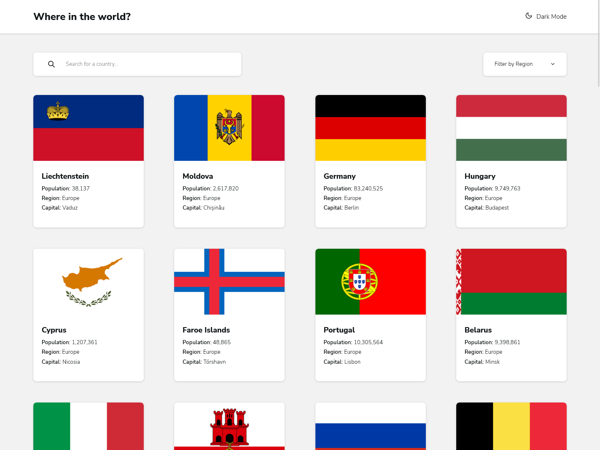

# Frontend Mentor - REST Countries API with color theme switcher solution

This is a solution to the [REST Countries API with color theme switcher challenge on Frontend Mentor](https://www.frontendmentor.io/challenges/rest-countries-api-with-color-theme-switcher-5cacc469fec04111f7b848ca). Frontend Mentor challenges help you improve your coding skills by building realistic projects.

## Table of contents

- [Overview](#overview)
  - [The challenge](#the-challenge)
  - [Screenshot](#screenshot)
  - [Links](#links)
- [My process](#my-process)
  - [Built with](#built-with)
  - [What I learned](#what-i-learned)
  - [Continued development](#continued-development)
  - [Useful resources](#useful-resources)
- [Author](#author)

## Overview

### The challenge

Users should be able to:

- [x] See all countries from the API on the homepage
- [x] Search for a country using an `input` field
- [x] Filter countries by region
- [x] Click on a country to see more detailed information on a separate page
- [x] Click through to the border countries on the detail page
- [x] Toggle the color scheme between light and dark mode _(optional)_

### Screenshot

### Links

- Solution URL: [Github repo](https://github.com/king-oldmate/FEM-country-rest-with-theme-switcher)
- Live Site URL: [Live Site](https://gorgeous-maamoul-26d737.netlify.app/)

## My process

### Built with

- Semantic HTML5 markup
- CSS custom properties
- Flexbox
- [React](https://reactjs.org/) - JS library

### What I learned

**CSS Variables:** Prior to this project I had been using TailwindCSS for everything. I still like TailwindCSS, but using it so soon meant that my uh.. pure CSS was lacking significantly. This was just one thing that I had never even used before.

**Test everything:** I may still have missed something but every time I'd add a function or use an array or object method I'd always run into cases that would break the page (e.g. countries not having bordering nations). Overall, a good experience in testing edge cases.

### Continued development

Still need to work on utilising APIs, it just hasn't clicked for me yet. Encapsulating it is also something I'd like to do.

### Useful resources

- [Easy Dark Mode](https://css-tricks.com/easy-dark-mode-and-multiple-color-themes-in-react/) - This article made the first time I implemented a theme switcher (this project) a breeze.
- [Thousands Separator](https://code-boxx.com/add-comma-to-numbers-javascript/) - Before I searched for this I was worried I'd have to write up a function to split and count and join and nope this was all I needed, `toLocaleString("en-US")`, sweet.
- [React loop through Object](https://bobbyhadz.com/blog/react-loop-through-object) - I occasionally struggle with objects and getting the right method, and this helped a lot with these nested objects and finding what I needed.

## Author

- Website - [Raymond Zeaiter](https://www.raymond-zeaiter.au)
- Frontend Mentor - [@king-oldmate](https://www.frontendmentor.io/profile/king-oldmate)
- Twitter - [@RayZeaiter](https://www.twitter.com/RayZeaiter)
